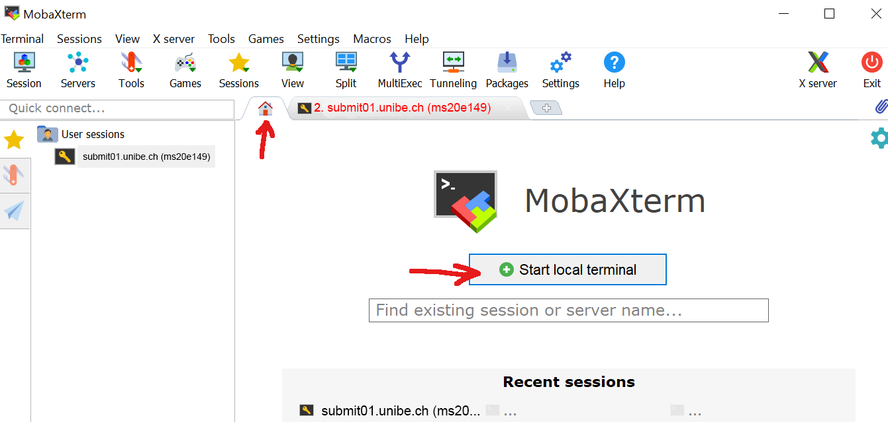
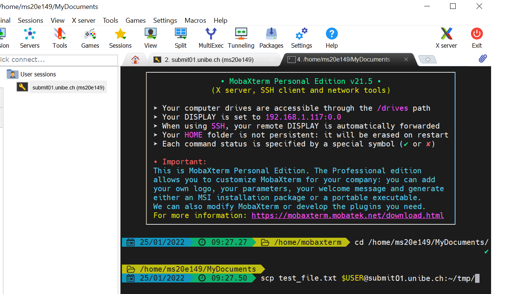

# File Transfer from/to UBELIX

## Description

This page contains some basic information about moving files between your local workstation and the cluster.

## Mac/Linux/Windows

You can use different protocols/programs for transferring files from/to the cluster, depending on your need: Sftp, SCP, Rsync, Wget, and others.

!!! types caution ""
    The following commands are from on your local workstation as indicated by "local$"

!!! types note ""
    If you have customized your SSH environment as described here, you can substitute your host alias for <user>@submit03.unibe.ch in the following commands


## Secure Copy (SCP) - Mac/Linux
Secure Copy is a program (also a protocol) that allows you to securely transfer files between local and remote hosts. SCP uses SSH for transferring data and managing authentication.
SCP performs a plain linear copy of the specified files, while replacing already existing files with the same name. If you need more sophisticated control over your copy process, consider [Rsync](file-transfer.md#remote-sync-rsync-maclinux).

!!! types note "Syntax"
    scp [options] source destination

!!! types note "Some common options"
    * `-r`: copy directories recursively (Note that SCP follows symbolic links encountered in the tree traversal)
    * `-p`: preserve modification time, access time, and modes from the original file
    * `-v`: verbose mode


### Copying Files from Your Local Workstation to UBELIX

Copy the file `~/dir/file01` to your remote home directory:

```Bash
$ scp ~/dir/file01 <user>@submit03.unibe.ch:
```

Copy multiple files to the remote directory `~/bar`:

!!! types note ""
    The destination directory must already exist. You can create a directory from remote with: ssh <user>@submit03.unibe.ch 'mkdir -p ~/bar'

```Bash
$ scp ~/dir/file01 ~/dir/file02 ~/dir/file03 <user>@submit03.unibe.ch:bar
```

Copy all files within directory `~/dir` to the remote directory `~/bar`:

!!! types note ""
    Add the -r option (recursive) to also copy all subdirectories of ~/dir

```Bash
$ scp -r ~/dir/* <user>@submit03.unibe.ch:bar
```

Copy the directory `~/dir` to your remote home directory:

!!! types note ""
    This will create a new directory ~/dir on the remote host. If the directory ~/dir already exists, the following command adds the content of the source directory to the destination directory

```Bash
$ scp -r ~/dir <user>@submit03.unibe.ch:
```

### Copying Files from UBELIX to Your Local Workstation

Copy the remote file `~/bar/file01` to the current working directory on your local workstation:

```Bash
$ scp <user>@submit03.unibe.ch:bar/file01 .
```


Copy multiple remote files to the local directory `~/dir`:

!!! types note ""
    The local directory ~/dir will be automatically created if it does not already exist

```Bash
$ scp <user>@submit03.unibe.ch:bar/\{file02,file03,file04\} ~/dir
```

Copy the remote directory `~/bar` to the current working directory on your local workstation:

```Bash
$ scp -r <user>@submit03.unibe.ch:bar .
```

## Remote Sync (Rsync) - Mac/Linux
Rsync implements a sophisticated algorithm that allows to transfer only missing/non-matching parts of a source file to update a target file. With this the process of transferring data may be significantly faster than simply replacing all data.
Among other things, Rsync also allows you to specify complex filter rules to exclude certain files or directories located inside a directory that you want to sync.


!!! types note "Syntax"
    rsync [options] source destination 

!!! types note "Some common options"
    * `-r`: copy directories recursively (does not preserve timestamps and permissions)
    * `-a`: archive mode (like -r, but also preserves timestamps, permissions, ownership, and copies symlinks as symlinks)
    * `-z`: compress data
    * `-v`: verbose mode (additional v's will increase verbosity level)
    * `-n`: dry-run
    * `-h`: output numbers in a human readable format


### Copying Files from Your Local Workstation to UBELIX

Copy the file `~/dir/file01` to your remote home directory:

```Bash
$ rsync ~/dir/file01 <user>@submit03.unibe.ch:
```

Copy multiple files to your remote home directory:

```Bash
$ rsync file01 file02 file03 <user>@submit03.unibe.ch:
```

Copy the local directory ~/dir to the remote directory ~/bar:

!!! types note ""
    With a trailing slash (/) after the source directory only the content of the source directory is copied to the destination directory. Without a trailing slash both the source directory and the content of the directory are copied to the destination directory

```Bash
$ rsync -az ~/dir/ <user>@submit03.unibe.ch:bar
```

### Copying Files from UBELIX to Your Local Workstation

Copy the remote file `~/foo/file01` to your current working directory:

```Bash
$ rsync <user>@submit03.unibe.ch:foo/file01 .
```

Copy the remote files `~/foo/file01` and `~/bar/file02` to your the local directory `~/dir`:

```Bash
$ rsync <user>@submit03.unibe.ch:\{foo/file01,bar/file02\} ~/dir
```

Copy the remote directory `~/foo` to the local directory `~/dir`:

!!! types note ""
    With a trailing slash (/) after the source directory only the content of the source directory is copied to the destination directory. Without a trailing slash both the source directory and the content of the directory are copied to the destination directory.

```Bash
$ rsync -az <user>@submit03.unibe.ch:foo/ ~/dir
```

### Including/Excluding Files

With the `--include`/`--exclude` options you can specify patterns, that describe which files are not excluded/excluded from the copy process.

!!! type note ""
    Use the `-n` option with the `-v` option to perform a dry-run while listing the files that would be copied

Exclude a specific directory:

```Bash
rsync -av --exclude "subdir1" ~/dir/ <user>@submit03.unibe.ch:
```

Copy only files with suffix `.txt` and `.m`:

```Bash
rsync -av --include "*.txt" --include "*.m" --exclude "*" ~/dir/ <user>@submit03.unibe.ch:
```

Copy all files with suffix `.m` within the source directory `~/dir` (including matching files within subdirectories) to the remote destination directory `~/foo`:

!!! type note ""
    Use the `--prune-empty-dirs` option to omit copying empty directories

```Bash
$ rsync -av --prune-empty-dirs --include "*/" --include "*.m" --exclude "*" ~/dir/ <user>@submit03.unibe.ch:foo
```


### Deleting Files

!!! type note ""
    None of the following commands will delete any files in your source folder

!!! type danger ""
    This delete options can be dangerous if used incorrectly! Perform a dry-run (`-n` option) first and verify that important files are not listed (`-v` option) for deletion

Use the `--delete` option to delete files/directories from the destination directory that are not/no more present in the source directory:

```Bash
$ rsync -av --delete ~/dir/ <user>@submit03.unibe.ch:mfiles
```

With the `--delete-excluded` option you can additionally delete files from the destination directory that are excluded from transferring/syncing (not in the generated file list):

```Bash
$ rsync -av --prune-empty-dirs --delete-excluded --include "*/" --include "*.m" --exclude "*" ~/dir/ <user>@submit03.unibe.ch:foo
```


## MobaXterm - Windows

In MobaXterm there are multiple ways to transfer files. After initializing/starting a session to UBELIX copied by "drag and drop" in the File browser on the left hand side. 

Further the local terminal can be used to transfer files using commands described above. 


