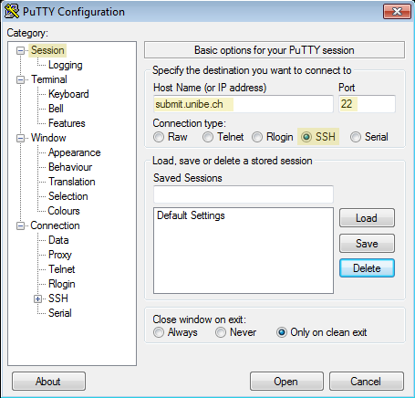
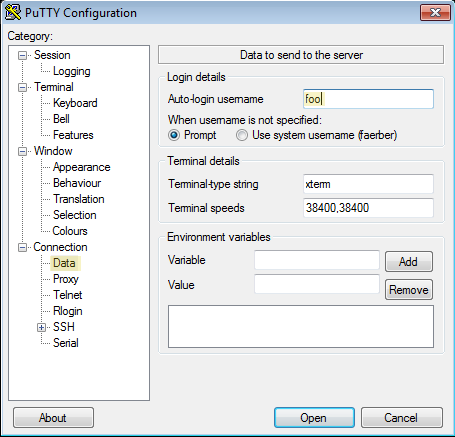
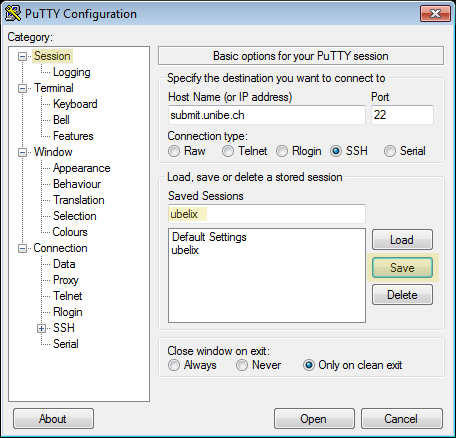

# Login

## Description

UBELIX is available to everybody with a valid Campus Account (CA) of the University of Bern. The cluster is meant to be used for research related to the University of Bern. 
**Before you can use this service we have to activate your CA for UBELIX**, see [Accounts and Activation](account.md). 
This page contains information on how to configure your SSH environment for a simplified login procedure and information regarding the application of a CA for external researchers.

## Log in to UBELIX

!!! types note "Before proceeding make sure that:"
    * you have your Campus Account activated for UBELIX (see above)
    * you have a working SSH client
        * you are operating on a Linux/Mac environment. If you are running Microsoft Windows you can use PuTTY MobaXterm or in Win10 the Subsystem Linux (WSL). 
    * please familiarize with a Unix-based command line, e.g. by installing a flavor of Linux using virtualization software (e.g VirtualBox)


!!! types caution "Requirement"
    Login to UBELIX is only possible from within the UniBE network. If you want to connect from outside, you must first establish a VPN connection. For VPN profiles and instructions see [the official tutorial](http://www.unibe.ch/university/campus_and_infrastructure/rund_um_computer/internetzugang/access_to_internal_resources_via_vpn/index_eng.html).


### Mac/Linux/Unix

Run the following commands in a terminal. Open an SSH connection to the submit host:

```Bash
$ ssh <username>@submit.unibe.ch
```
At the password prompt enter your Campus Account password:

```Bash
$ ssh <username>@submit.unibe.ch
Password:
```

!!! types note ""
    Usually there is no indication of typing when entering your password (not even asterisks or bullets). That's intended. Just enter your password and press 'enter'.

After log in successfully you will see the welcome message and the command prompt:

```Bash
Last login: Tue Apr 21 16:17:26 2020

CentOS 7.7.1908.x86_64

FQDN:      submit01.ubelix.unibe.ch (10.1.129.21)
Processor: 24x Intel(R) Xeon(R) CPU E5-2630 v2 @ 2.60GHz
Kernel:    3.10.0-1062.9.1.el7.x86_64
Memory:    62.73 GiB
```

Congratulations, you just logged in to the cluster! You can immediately start using UBELIX.

### Microsoft Windows

We use PuTTY to illustrate how to establish a SSH connection from a Windows client to UBELIX. There are of course other SSH clients for Windows available that serve the same purpose.

!!! types note "Download"
    You can download PuTTY from [http://www.putty.org](http://www.putty.org/)


In category "Session" specify:  
Connection type: SSH  
Host name (or IP address): submit.unibe.ch  
Port: 22



In category "Connection"/"Data" specify:
Auto-login username: <username> (Enter your username here)




To save your session, in category "Session" specify:  

Saved Session: ubelix (you can choose your own session name) and click the "Save" button




Click "Open" to establish a new connection.

At the password prompt enter your password:


!!! types note ""
    Usually there is no indication of typing when entering your password (not even asterisks or bullets). That's intended. Just enter your password and press 'enter'.


After log in successfully you will see the welcome message and the command prompt:


Congratulations, you just logged in to the cluster! You can immediately start using UBELIX.


## Customize your SSH session
Useful feartures like SSH alias, X and port forwarding are described on our page [SSH customization](ssh-customization.md).