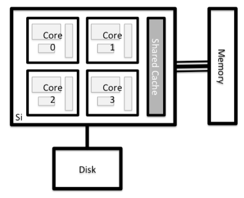
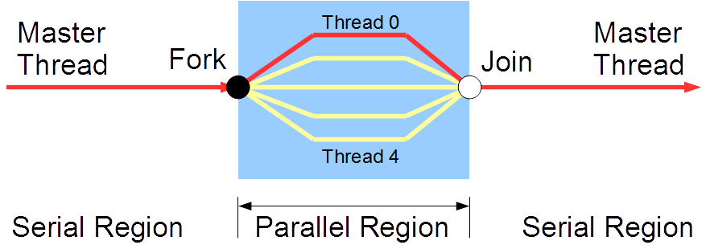
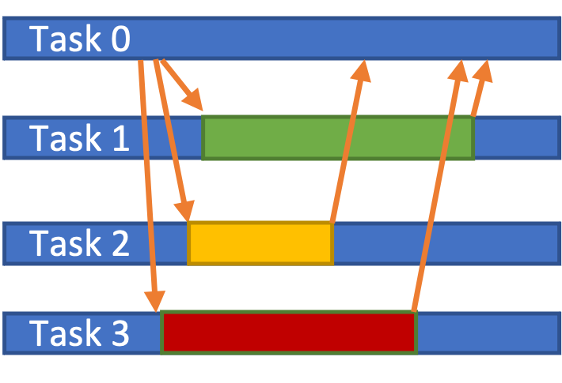

# Parallelization

## Description

[//]: <> (Optimization)

With an increasing demand of more accuracy and therewith a reduced time to solution, application speed need to be increased. On the one hand, the CPU frequency is limited and will not significantly increase in future. On the other hand, the available computing resources increase continuously. More and more compute cores are available in all sorts of devices. Starting with your local laptops and cell phones up to extremely powerful supercomputers. 

These increasing amount of resources can be utilized to perform tasks in parallel, where possible and therewith reduce the overall simulation time. 

There are 3 main concepts in parallelization:

- shared memory: thread parallel, mostly OpenMP
- distributed memory: Task parallel; requiring communication (MPI)
- Offloading: Utilizing a so called accelerator, e.g. a General Purpose Graphic Processing Unit (GPGPU), using CUDA, OpenACC, OpenMP target directive

Here we briefly describe and compare these three concepts and then shortly discussing extended memory requirements. This is not meant to be complete, nor a programming guide. 

## Preface
First, it should be mentioned that just requesting more compute resource does not necessary improve the performance of the application. On the one hand, the application need to be programmed to being able to utilize the resources, using specific programming models and programming languages. On the other hand, even if the application supports parallelization, the one or the other way, the efficiency is limited by the application algorithm and the problem size, leading to a specific scaling behavior. 

Without any specific implementation an application will be executed on **one** CPU core, even if more cores are accessible. This is called serial execution. The different parallelization models are described below. If an application supports parallel execution for desired features should be mentioned in the application description. Furthermore, the command `ldd <exe>` can list all linked libraries. Therewith, parallelization libraries should be listed. 

An application could support multiple parallelization models. If possible, often a hybrid (task **and** thread parallelism) is most efficient, e.g. 5 tasks with 4 threads each. The ration depends on the algorithm and problem size. 

### Vectorization
A serial application on a single CPU core can be improved in performance using vectorization. Instead of computing a single value at a time, vectorization allows to operate a single instruction on multiple data (SIMD). The size of the simultaneously computed set of data is determined by the instruction set (SSE, AVX, AVX2), which defined by the CPU architecture. Furthermore, the application need to be compiled for these instruction sets. The compiler tries to optimize for the targeted architecture. Different compilers (GCC, Intel, ...) optimize application differently. There is no better or worse compiler. It typically depends on the implemented algorithm and the way it is programmed and the compiler. Some compilers can provide compiler feedback, which may hint to suggestions where applications are vectorized, where not, and sometimes reasons for not vectorizing a loop. 

Most important is that the compiler detects the target architecture instruction set. Advisable is to compiling on the target architecture and/or specifying the target instruction set, e.g. `gcc -mavx2 ...`. 

## Basic Hardware Architectural Considerations

Supercomputers and Clusters are typically build of compute nodes (neglecting service and login nodes), a high speed network, and high bandwidth storage. 
The compute nodes are different types of compute nodes, with 2 CPUs, or a CPU and an accelerator (GPU). All nodes have CPU(s), Random-access Memory (RAM) and network card, additionally there may be accelerators, like GPUs, and a hard disk (HDD).



Considering a CPU compute node (without GPUs), there are typically 2 CPUs, e.g. Intel Broadwell or AMD Epyc2. Each CPU consists of many compute cores an different stages of low level memory (L1, L2, L3 cache). The CPU cores are the units performing the actual computation. The different CPU cores can work on the same or on different applications, orchestrated by the scheduler. 


## Shared memory / OpenMP

Shared memory parallelization also know as **Threading** utilizes cores on one single node where each core can access the same RAM (Random-access memory). The most common implementation are OpenMP pragmas. 

C example:

```C
#pragma omp parallel for 
for(int i=0; i<len(a); i++) 
	//do stuff
```

In many applications a (list of) operations need to be performed on a more or less large amount of data, e.g. running a loop over elements of an array, and computing various values.
If enabled during compile time, the different iterations in the above example can run on different CPU cores. 



The amount of utilized cores is specified during runtime by SLURM (using `--cpus-per-task` option) and noted to the application using `$OMP_NUM_THREADS` (or in worse case hard-coded by the programmer). There can be multiple parallel regions the application. 

### Compiling and Running

OpenMP pragmas are comments in the code. The compiler only react on it, when using a specific compile option, e.g. `gcc -fopenmp ...`. Thus, the same code could be build with or without threading support. 

When launching the application the threads are spawned on ***n*** CPU cores, when resources are requested with `--cpus-per-task`***`n`***. 


### Threading in libraries

In certain libraries algorithms already are implemented using threading, for example in BLAS and ScaLAPACK. If the usage of such libraries dominate the overall runtime it can be efficient to inquire multiple threads/cores even if the original application does not use threading. 

### Efficiency

The dominating factor for efficiency is determined by the ration time in parallel regions and time in serial regions. The more time is spend in serial regions the less efficient is the parallelization. 


## Distributed memory / MPI

Regarding a cluster system, each node is an independent computer, tied together with a network system. The individual nodes have their own system daemons controlling processes and their own memory. And by default, a CPU core from one node has no access to the memory of a different node. 
Sharing work across multiple nodes require communication over the network. These messages are handled by the Message Passing Interface (**MPI**), and defined by the application programmer.

The application process looks like:

- `srun <exe>` will start the executable on all ***N*** tasks (CPU cores)
- at the beginning all ***N*** instances perform the operation
- each instance has MPI rank specified by SLURM
- the application react to the rank ID and change code path


As am example, a worker/manager algorithm may first distribute tasks to the workers and later collect the results:



The advantage is that the different tasks can be performed on different nodes. In contrast to threading, where the job is limit to the size of a node, MPI parallel jobs are "only" limited by the size of the cluster or SLURM resource limitations. 

### Compiling and Running

Applications using MPI need to be compiled with an MPI compiler, e.g. mpicc. There are also libraries for Python mpi4py, which under the hood will utilize one of the lower level libraries like OpenMPI or Intel MPI. Therefore, one of these modules need to be loaded when installing and running mpi4py.

In general, the MPI module need to be loaded during runtime, which is used for building the application.
When submitting the job, ***N*** MPI tasks are requested using the `--ntasks`***`N`*** option. 

### Efficiency

The ***N*** task presumably will perform different tasks in parallel. At certain stages there need to be communication between the tasks. This could be simple results, but also configurational stati. In most cases the communication overhead increases significantly with increasing job sizes. 

Furthermore, the communication is faster the closer the tasks are together. The fastest communication is typically within one node. The wider the job is distributed over the machine, the larger the latency. 

Last but not least, in extreme cases the job can be willingly spread over a larger amount of nodes to increase the available memory. If 20 tasks on one Broadwell node needs to share 256GB, these 20 tasks on 4 nodes can utilize up to 1TB of memory. 

## GPGPU

General Purpose computation on Graphic Processing Units (GPGPU) utilize GPUs for parallel computations. There can be multiple GPUs next to the CPU, each having thousands of compute cores. In contrast to CPU cores, these cores need to perform exactly the same instructions, the frequency is lower and the data need to be copied first to the GPU and later back. Therewith, only computations of very large data sets are efficient. 

Again the application need to programmed and build to utilize these resources. There are multiple languages offloading tasks to GPUs: CUDA, OpenACC, OpenMP target directives, OpenCL,...

### Compiling and Running

The application again need to be build specifically for GPU. For CUDA, the `nvcc` compiler need to be used. Furthermore, there are compiler optimization flags for different GPU architectures. 

When submitting a job to a GPU node, the partition **and** the GPU architecture need be specified, see [GPU jobs](../slurm/gpus.md)

## Scaling

The main goal of parallelization is the reduction in the overall runtime. There more resources are utilized. In an **ideal case**, a linear scaling can be considered, where the whole algorithm can be parallelized and the parallelization overhead is zero. Therewith utilizing the double amount of CPU cores would half the runtime. 
But even linear scaling is limited. At a certain point always the overhead dominates and the advantage of more resources does not lead to performance improvements anymore. 

The sweet spot between more resources and shorter runtime need to be tested with an representable use case, utilizing the target algorithm, in best few minutes short (e.g. limited iterations), and a representable data set. Then by increasing the problem sizes and the job size the scaling could be estimated. 

The different parallelization methods can be combined, if supported. For example an application can use OpenMP threads and MPI tasks at the same time. 
