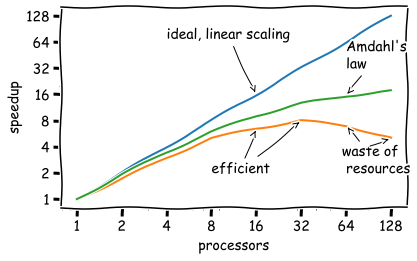

# Job Scaling

!!! type warning "This page is ..."
	still under construction

## Description

Seeking for performance improvements, applications are parallelized. The effective runtime should be decreased, by utilizing more compute resources. 
There are multiple ways of parallelization. 
**Threading** is used on shared memory architectures, implemented via OpenMP. 
**Task parallel** algorithms using MPI can run across multiple nodes. 
A so called **hybrid application** can use the advantages of both methods.

In the following, threading (OpenMP) and task parallelism (MPI) is discussed. 
Then, scaling is discussing. 

## OpenMP
A threaded application is executed once. SLURM reserves the specified number of CPU cores for this instance. When instructed in the application, threads are spawned and later merged. 
In ideal case **one thread** runs on **one CPU core**. On other hardware settings (and for specific algorithms) hyperthreading (depending on the hardware: 2 threads per core) could be sufficient. On UBELIX hyperthreading is disabled.

If not specified in the application, the amount of CPU cores per node may be determined and used, or maybe a large amount of threads. 
Most of UBELIX compute nodes are shared, an application will typically utilize a subset of CPU cores. By limiting the amount of threads, overpopulation of CPU cores is prevented and therewith inefficient context switching. 
The amount of OpenMP threads should be limited to to the amount of requested resources. Therefore, the environment variable `$SLURM_CPUS_PER_TASK` or better the general solution **`$OMP_NUM_THREADS`** should be used. 

[TODO]: <> (threading not only limited by cores with shared memory -> performance sweet spot earlier)

## MPI

[TODO]: <> (too many tasks -> communication overhead -> decreasing performance )

## Scaling

### General Aspects

**Amdahl's law** provides a theoretical upper limit of an application speedup, considering a fixed problem size. 
Depending on the ratio between time spend in parallel versus serial regions the applications speedup scales further.  

Even if almost the whole time is spend in parallel regions, practically the scaling is limited. At a certain point a parallelization overhead will dominate, e.g. the communication in MPI. At a certain point, increasing resource requests may lead to decreasing performance. 

### Empirical Tests

Especially for applications utilized many times, we may want to determine the sweet spot between performance improvement and resource usage.
Therefore, a representative test case should be selected. Ideally it would be relatively short in runtime (few iterations, *O*(5min)), using the targeted algorithm and a representative problem size.
Then the scaling would be tested separate for threading (if applicable), and MPI tasks. 
