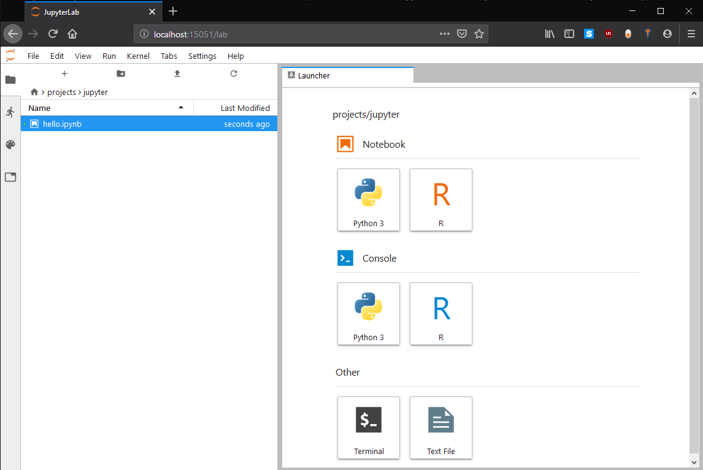

# Jupyter Lab

## Description

Some useful information on using Jupyter Lab on UBELIX compute nodes.  

> **IMPORTANT:** in the following we show how to start the server on a compute node. 
> Please keep in mind that these resources will be dedicated for you, thus and idle session will waste resources. 
> **Please quit your session as soon as you don't use it anymore**, even for a lunch break. Your notebook will maintain all you input/output.

## Overview

On UBELIX we provide Jupyter Lab for working with Jupyter Notebooks. 
JupyterLab is a single-user web-based Notebook server, running in the user space. 
JupyterLab servers should be started preferably on a compute node, especially for compute intensive or memory intensive workloads. 
After starting the Jupyter Lab server your local browser can be connected using port forwarding. Therefore port forwarding needs to be enabled properly. 
On this page we describe:

* Launch JupyterLab
    * Connect to UBELIX and establishing SSH port forwarding 
    * SSH with port forwarding
    * Launch the JupyterLab server
    * Launch JupyterLab in your local browser
* Kernels
* Packages

## Launch JupyterLab

Since JupyterLab is a web based application, a port needs to be forwarded to your local machine, where your browser can connect to. 
This port numbers need to be between 2000 and 65000 and need to be unique on the present machine. 
The default port for JupyterLab is 8888, but only one user can use this at a time.

To avoid the need for modifying the following procedure again and again, we suggest to (once) select a unique number (between 2000 and 65000). And then following commands can be hopefully reused without modification.  
The port needs to be specified while establishing the connection to UBELIX and while launching JupyterLab. In the following we use the port number 15051 (**please select another number**).

### Passwordless SSH within the HPCs

Please verify that you created and registered a SSH key within UBLEIX. If you can perform the following command without entering your password your are ready to go:
```Bash
ssh localhost
```
otherwise create and register a new key on a login node.
```Bash
ssh-keygen -t rsa -b 4096
cat ~/.ssh/id_rsa.pub >> ~/.ssh/authorized_keys
chmod 640 .ssh/authorized_keys
```

### Setup SSH with port forwarding 

First, the port forwarding needs to be enabled between your local machine and UBELIX. Therewith a local port will be connected to the remote port on UBELIX. For simplicity, we kept both numbers the same (here 15051). This can be specified on the command line in the terminal.

> Note: MobaXterm has an internal terminal which acts like a linux terminal and can be configured as described in the Standard Terminal Setup. Therewith, the SSH command line approach above can be used.

### SSH with port forwarding

The ```ssh``` command from your **local machine** to the ubelix login node  needs to be called with following arguments:

```
ssh -Y -L 15051:localhost:15051 <username>@submit.unibe.ch
```
If configured in your ```.ssh/config```, you can also use the alias instead of the full name for UBELIX. Where `<username>` is you campus account name.

### Launch the JupyterLab server 

On UBELIX, the required *Anaconda3* module needs to be loaded. If you want to use additional kernels (R) you need to load additional modules, e.g. IRkernel (for R kernels):

```
module load Anaconda3
```

A script is provided, taking care of enabling the port forwarding to the compute node and launching JupyterLab. 

```
jupyter-compute 15051 --time=00:45:00  # please change port number
```
This tool will lauch the server on a compute node, and establish the port forwarding.
After general output, JupyterLab prints a URL with a unique key and the network port number where the web-server is listening, this should look similar to:

```
...
[C 21:43:35.291 LabApp]

    To access the notebook, open this file in a browser:
        file:///gpfs/homefs/id/ms20e149/.local/share/jupyter/runtime/nbserver-30194-open.html
    Or copy and paste one of these URLs:
        http://anode001:15051/?token=69ba5d24acab5915f2520c008a57df51f3cc38b7050ea073
     or http://127.0.0.1:15051/?token=69ba5d24acab5915f2520c008a57df51f3cc38b7050ea073
```

### JupyterLab in your local browser
The full address on the last line (starting with the 127.0.0.1) including the token needs to be copied into your browser on your local machine. 
After initializing Jupyter Lab you should see a page similar to:



Therewith the Notebook and its containing tasks are performed on a compute node, which can double check e.g. using using the following in Python:

```
import socket
print(socket.gethostname())
```

> IMPORTANT: Please remember to stop your Jupyter Lab server and therewith your slurm job, when you do not need it anymore. Thus, the resource get available to other users again. 

> Note: After stopping the JupyterLab server some sessions may get corrupted and do not take input correctly anymore. In this case just quit and re-establish your ssh session.

### JupyterLab with multiple CPU cores
More resources can be requested, e.g. by using:

```
jupyter-compute 15051 --ntasks 1 -t 60 --cpus-per-task 5 --mem 512MB
```
Where 5 cores are requested for threading and a total memory of 3GB. 
Please do not use multiprocessing.cpu_count() since this is returning the total amount of cores on the node. 
Furthermore, if you use libraries, which implement threading: align the numbers of threads (often called jobs) to the selected number of cores (otherwise the performance will be affected).

OR requesting GPU resources on a node with a NVIDIA graphics card:
```
jupyter-compute 15051 --ntasks 1 -t 60 --partition=gpu --gres=gpu:gtx1080ti:1
```

> **Note:** This tool can only be used in the *all* and *gpu* partition. 

## Kernels

The following JupyterLab kernel are installed:

* Python3
* R

### R

verify that the module *IRkernel* is loaded

```
module load IRkernel
```

## Packages

There are a long list of default packages provided by Anaconda3 (list all using `!pip list`) and R (list using `installed.packages(.Library)`, note the list is shortened). 

Furthermore, you can install additional packages in Python using `pip install --user` or in R using `install.packages("sampling")`. 
