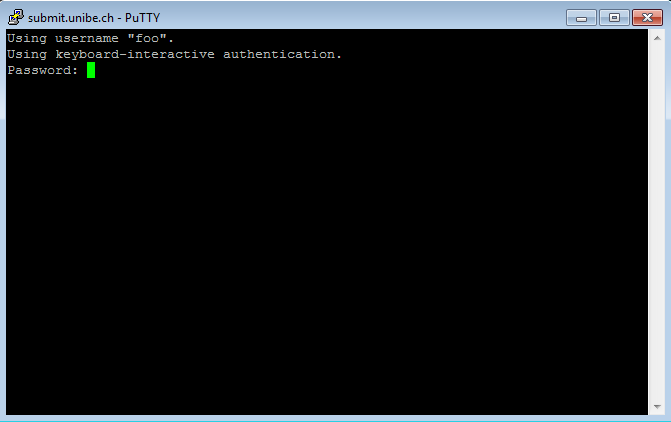
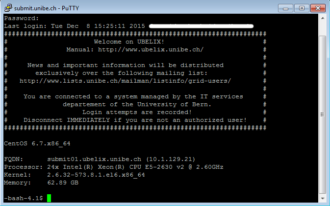

# Account Activation and Login

## Description
UBELIX is available to everybody with a valid Campus Account (CA) of the University of Bern. The cluster is meant to be used for research related to the University of Bern. **Before you can use this service we have to activate your CA for UBELIX**. On this page you will find useful information regarding the activation of your CA and the login procedure. Additionally, this page contains information on how to configure your SSH environment for a simplified login procedure and information regarding the application of a CA for external researchers.


## Account activation

**Request for activation**

To request the activation of your Campus Account, please send an email to [hpc@id.unibe.ch](mailto:hpc@id.unibe.ch) including:

* a brief description of what you want to use the cluster for
* **your Campus Account username**

Students must additionally provide:

* Students must additionally provide:
* the name of the institute (e.g. Mathematical Institute)
* if available, the name of the research group (e.g. Numerical Analysis)

If you possess multiple Campus Accounts (staff and student) use your staff account since this one is more specific. As soon as we get your email we will activate your account for UBELIX. Once activated, you will receive a confirmation email containing initial instructions

You cannot choose a new username for UBELIX. The username/password combination will be the same as for your Campus Account that you also use to access other services provided by the University of Bern (e.g: email, Ilias).

### Apply for a Campus Account for external coworkers

If you do not have a Campus Account of the University of Bern, but you need access to the cluster for your cooperative scientific research with an UniBE institute, the account manager of the institute has to request a Campus Account from the IT department of the University of Bern. Please ask your coworker at the institute to arrange this for you. The responsible account manager at your institute can be found from the following link: [Account managers](http://www.unibe.ch/universitaet/campus__und__infrastruktur/rund_um_computer/campus_account/zustaendige_kontoverantwortliche_nach_abteilungen/index_ger.html)

### Mailing List

The official channel for informing the UBELIX community about upcoming events (e.g. maintenance) and other important news is our mailing list. **Sign up to receive information on what's going on on the cluster:**

[https://listserv.unibe.ch/mailman/listinfo/hpc-users](https://listserv.unibe.ch/mailman/listinfo/hpc-users) 


## Log in to UBELIX

!!! types note "Before proceeding make sure that:"
    * you have your Campus Account activated for UBELIX (see above)
    * you have a working SSH client
    * you are operating on a Linux/Mac environment. If you are running Microsoft Windows you can use PuTTY, but we strongly encourage you to familiarize with a Unix-based operating system, if necessary by installing a flavor of Linux using virtualization software (e.g VirtualBox)


!!! types caution ""
    Log in to UBELIX is only possible from within the UniBE network. If you want to connect from outside, you must first establish a VPN connection. For VPN profiles and instructions see [the official tutorial](http://www.unibe.ch/university/campus_and_infrastructure/rund_um_computer/internetzugang/access_to_internal_resources_via_vpn/index_eng.html).


### Mac/Linux/Unix

Run the following commands in a terminal. Open an SSH connection to the submit host:

```Bash
$ ssh <username>@submit.unibe.ch
```
At the password prompt enter your Campus Account password:

```Bash
$ ssh <username>@submit.unibe.ch
Password:
```

!!! types note ""
    Usually there is no indication of typing when entering your password (not even asterisks or bullets). That's intended. Just enter your password and press 'enter'.

After log in successfully you will see the welcome message and the command prompt:

```Bash
Last login: Tue Apr 21 16:17:26 2020

CentOS 7.7.1908.x86_64

FQDN:      submit01.ubelix.unibe.ch (10.1.129.21)
Processor: 24x Intel(R) Xeon(R) CPU E5-2630 v2 @ 2.60GHz
Kernel:    3.10.0-1062.9.1.el7.x86_64
Memory:    62.73 GiB
```

Congratulations, you just logged in to the cluster! You can immediately start using UBELIX.

### Microsoft Windows

We use PuTTY to illustrate how to establish a SSH connection from a Windows client to UBELIX. There are of course other SSH clients for Windows available that serve the same purpose.

!!! types note "Download"
    You can download PuTTY from [http://www.putty.org](http://www.putty.org/)


In category "Session" specify:  
Connection type: SSH  
Host name (or IP address): submit.unibe.ch  
Port: 22


In category "Connection"/"Data" specify:
Auto-login username: <username> (Enter your username here)


To save your session, in category "Session" specify:  

Saved Session: ubelix (you can choose your own session name) and click the "Save" button


Click "Open" to establish a new connection.

At the password prompt enter your password:




!!! types note ""
    Usually there is no indication of typing when entering your password (not even asterisks or bullets). That's intended. Just enter your password and press 'enter'.


After log in successfully you will see the welcome message and the command prompt:



Congratulations, you just logged in to the cluster! You can immediately start using UBELIX.


## Customize your SSH environment

### Create a SSH alias

**Mac/Linux/Unix**

To simplify the login procedure you can define an alias for the user-/hostname combination. Add a host declaration to ~/.ssh/config (substitute your own alias and username):


**~/.ssh/config**
```Bash
Host <alias>
    Hostname submit.unibe.ch
    User <username>
```

From now on you can log in to the cluster by using the specified alias:

```Bash
$ ssh <alias>
```

You still have to provide your password!

### SSH session timeout

**Mac/Linux/Unix**  
If a SSH connection goes idle for a specific amount of time (default 10 minutes), you may be confronted with a "Write failed: Broken pipe" error message or the connection is simply frozen, and you are forced to log in again. To prevent this from happening, configure the client to periodically (e.g. every 60 seconds) send a message to trigger a response from the remote server. To do so, add the following line to the SSH configuration file:

```Bash
ServerAliveInterval 60
```

The host declaration may now look like this:

**~/.ssh/config**
```Bash
Host <alias>
    Hostname submit.unibe.ch
    User <username>
    ServerAliveInterval 60
```

### SSH key pairs

**Mac/Linux/Unix**  
SSH keys serve as a means of identifying a user to a SSH server. When using SSH keys your password will never be send over the network.

!!! types caution ""
    Remember to always keep your private key private! Only share your public key, never share your private key.

If you already have a valid private/public key pair that you also want to use for UBELIX, you can omit the rest of this section and continue with "Adding a public key to your UBELIX account".

First, generate a private/public key pair. You can substitute your own comment (-C).  To accept the default name/location simply press Enter, otherwise specify a different name/location:

```Bash
$ ssh-keygen -t rsa -b 4096 -C "ubelix"
Generating public/private rsa key pair.
Enter file in which to save the key (/Users/faerber/.ssh/id_rsa):
```

Enter and confirm a secure passphrase:

!!! types caution ""
    If you do not specify a passphrase and someone else gets a copy of your private key, then he will be able to login with your identity on any account that uses the corresponding public key!

```Bash
Enter passphrase (empty for no passphrase):
Enter same passphrase again:
```

**Adding a public key to your UBELIX account**  
If you have specified a custom name/location for your SSH keys, you can tell your SSH client to use this key for connecting to UBELIX by specifying the private key on the command line:

```Bash
$ ssh -i ~/.ssh/id_rsa_ubelix <alias>
```

or even better, add the key to your host declaration in your ssh configuration:

**~/.ssh/config**
```Bash
Host <alias>
    Hostname submit.unibe.ch
    User <username>
    ServerAliveInterval 60
    IdentityFile ~/.ssh/id_rsa_ubelix
```

Now, login to UBELIX and append your public key (content of id_rsa.pub) to the file ~/.ssh/authorized_keys. This step can also be done by simply issuing ssh-copy-id -i ~/.ssh/id_rsa_ubelix.pub <alias>. If everything was correct, you will now be able to login without providing you Campus Account password upon your next login attempt. However, if you have secured your key with a passphrase, you will get prompted for your passphrase instead. You can use ssh-agent to securely save your passphrase, so you do not have to re-enter it all the time.

**Adding your Key to SSH-Agent**  
The behavior of ssh-agent depends on the flavor and version of your operating system. On OS X Leopard or later your keys can be saved in the system's keychain. Most Linux installations will automatically start ssh-agent when you log in.


Add the key to ssh-agent:

```Bash
$ ssh-add ~/.ssh/id_rsa_ubelix
```
